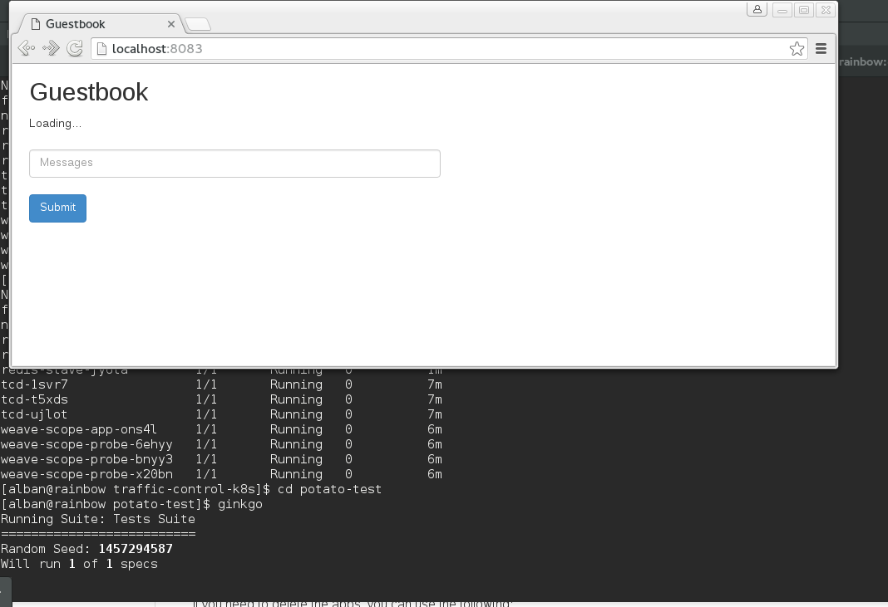

# Demo: traffic control between Kubernetes pods

This demo demonstrates how to use traffic control to test applications running in Kubernetes.
It uses [Kubernetes](http://kubernetes.io/), [tcd](https://github.com/kinvolk/tcd) and [Weave Scope](https://github.com/weaveworks/scope) together.

## Install Kubernetes on Vagrant

Follow the instructions on [Kubernetes Installation with Vagrant & CoreOS](https://coreos.com/kubernetes/docs/latest/kubernetes-on-vagrant.html) with the following modifications:

- Use `$worker_count=3` in `config.rb`

Check that `kubectl` works properly:

```
export KUBECFG=$GOPATH/src/github.com/coreos/coreos-kubernetes/multi-node/vagrant/kubeconfig
cd $GOPATH/src/github.com/kinvolk/demo/traffic-control-k8s
kubectl --kubeconfig=$KUBECFG get pods
```

Update your `~/.ssh/config` with the content of `vagrant ssh-config`.
Check that you can ssh to `c1`.

## Install tcd and Weave Scope

Install the daemon sets, replication controllers, and services, following the correct order:
```
kubectl --kubeconfig=$KUBECFG create -f tcd-ds.yaml
kubectl --kubeconfig=$KUBECFG create -f scope-app-rc.yaml
kubectl --kubeconfig=$KUBECFG create -f scope-app-svc.yaml
kubectl --kubeconfig=$KUBECFG create -f scope-probe-ds.yaml
```

The Weave Scope yaml files originally come from [Weavescope](https://github.com/TheNewNormal/kube-charts/tree/master/weavescope/manifests) but with the following modifications:
- set fixed virtual IP in Kubernetes services.
- use a version of Scope with patches for traffic control, see https://github.com/weaveworks/scope/issues/1022

TODO: For now, the patches are on https://github.com/alban/scope (branch master). Once Scope has a plugin system, the patches should be updated to use that.

## Install the simple "ping" app

```
kubectl --kubeconfig=$KUBECFG create -f ping.yaml
```

## Install the guestbook

```
kubectl --kubeconfig=$KUBECFG create -f guestbook-all-in-one.yaml
```

This is based on the [Kubernetes Guestbook Example](https://github.com/kubernetes/kubernetes/tree/master/examples/guestbook) but it exposes two different versions of the frontend.
The sources of the two versions are available in [frontend-php-redis/](frontend-php-redis/)

## Prepare your browser for the demo

Keep a terminal open with ssh redirections:
```
ssh -L 4042:10.3.0.131:4040 -L 8082:10.3.0.143:80 -L 8083:10.3.0.144:80  c1
```

And save the following bookmarks in your browser:
- "Demo Scope": [http://localhost:4042/](http://localhost:4042/)
- "Demo Guestbook V1": [http://localhost:8082/](http://localhost:8082/)
- "Demo Guestbook V2": [http://localhost:8083/](http://localhost:8083/)

## Demo 1

- Go to "Demo Scope" in the browser
- Locate a "ping" pod
- Click on the "Attach" button
- Notice that it downloads the file every 2 seconds quite quickly
- Click on the new "Traffic Control" buttons
- See how it changes the latency


## Demo 2

- Go to "Demo Guestbook V1" in the browser
- Add some messages in the guestbook
- Locate the frontend pod (V1)
- Add latency
- Notice how refreshing the guestbook page becomes slow
- Notice that there is no user feedback whether the guestbook is fully loaded
- Go to "Demo Guestbook V2" in the browser
- Locate the frontend pod (V2)
- Add latency
- Notice that this version has user feedback
- Run the tests on this new version:

```
cd potato-test
ginkgo
```



## Delete

If you need to delete the apps, you can use the following:

```
kubectl --kubeconfig=$KUBECFG delete -f scope-probe-ds.yaml
kubectl --kubeconfig=$KUBECFG delete -f scope-app-svc.yaml
kubectl --kubeconfig=$KUBECFG delete -f scope-app-rc.yaml
kubectl --kubeconfig=$KUBECFG delete -f tcd-ds.yaml

kubectl --kubeconfig=$KUBECFG delete -f guestbook-all-in-one.yaml

kubectl --kubeconfig=$KUBECFG delete -f ping.yaml
```
